[<<< Go back to Manual Contents Page](https://github.com/WCSCourses/GenEpiLAC2024/blob/main/Manuals/Manual_main.md)

<br>

# Genome Assembly and Analysis - Costa Rica 2024 <!-- omit in toc -->

### Module Leads: Jordan Ashworth and Mat Beale <!-- omit in toc -->

<br>

# Table of contents <!-- omit in toc -->
- [Module Overview and Aims](#module-overview-and-aims)
  - [Background](#background)
  - [An outbreak sample](#an-outbreak-sample)
  - [Analyses](#analyses)
  - [The research questions](#the-research-questions)
  - [Finding the data](#finding-the-data)
- [Examining the resistome](#examining-the-resistome)
  - [Step 1: Download the `ResFinder` database](#step-1-download-the-resfinder-database)
  - [Step 2: Run `ariba` on 16B](#step-2-run-ariba-on-16b)
  - [Step 3: Run `ariba` on MW2](#step-3-run-ariba-on-mw2)
  - [Step 4: Run `ariba` on MSSA476](#step-4-run-ariba-on-mssa476)
  - [Step 5: Compile the `ariba` results](#step-5-compile-the-ariba-results)
  - [Step 6. Visualize in Phandango](#step-6-visualize-in-phandango)
- [Generating a _de novo_ assembly](#generating-a-de-novo-assembly)
  - [Step 7. Assemble 16B reads using `Unicycler`](#step-7-assemble-16b-reads-using-unicycler)
  - [Step 8. Assess the asembly quality using `QUAST`](#step-8-assess-the-asembly-quality-using-quast)
- [Investigating genomic composition](#investigating-genomic-composition)
  - [Step 9. Ordering the assembly against a reference genome using `abacas`](#step-9-ordering-the-assembly-against-a-reference-genome-using-abacas)
  - [Step 10. Identify highly similar regions using `blastn`](#step-10-identify-highly-similar-regions-using-blastn)
  - [Step 11. Explore local genomeic matches in `act`](#step-11-explore-local-genomeic-matches-in-act)
  - [Step 12. Mapping reads back to the ordered assembly using `snippy`](#step-12-mapping-reads-back-to-the-ordered-assembly-using-snippy)
- [Generating the genome annotation](#generating-the-genome-annotation)
  - [Step 13. Genomic annotation using `bakta`](#step-13-genomic-annotation-using-bakta)
  - [Step 14. Visualizing the `bakta` annotation](#step-14-visualizing-the-bakta-annotation)
- [Examining the evolution of drug resistance in ST1 _S. aureus_](#examining-the-evolution-of-drug-resistance-in-st1-s-aureus)
  - [Step 15.](#step-15)

<br>

# Module Overview and Aims

One of the greatest challenges of sequencing a genome is determining how to arrange sequencing reads into chromosomes and plasmids. This process of determining how the reads fit together by looking for overlaps between them is called genome assembly. In this module, we are going to explore genome assembly using short- and long-read sequencing technologies and see how they can be used to characterize isolates of interest. Additionally, we will annotate these genomes and use comparative genomics to analyze regions of difference and identify genetic determinants of antibiotic resistance.

Aims of this exercise:

*	Use a resistome prediction tool to identify the genetic determinants for antibiotic resistance from sequencing reads.
*	Show how short-read data can be assembled into a draft genome.
*	Order the draft genome against a reference sequence.
*	Annotate the reordered draft genome.
*	Demonstrate how comparative genomics can identify and analyse regions of difference that distinguish genomes.
*	Identify the genetic basis of resistance and explain the evolution of resistance in the isolates investigated.

<br>

## Background

*Staphylococcus aureus* is a bacterial pathogen that has garnered attention in recent years due to its capacity to evolve into highly virulent and antibiotic-resistant strains. Its prevalence in hospital settings poses a significant burden on healthcare systems worldwide, being the leading cause of hospital-acquired infections. The rise of antibiotic resistance among *S. aureus* strains, particularly to β-lactam antibiotics like methicillin, has reached alarming levels in regions such as Europe, the US, and Japan, where 40-60% of hospital-acquired *S. aureus* infections are now methicillin-resistant. The emergence of methicillin-resistant *S. aureus* (MRSA) dates back to the 1960s, and since then, various successful clones have disseminated globally.

## An outbreak sample

In this module, we will assemble the genome of a strain of *Staphylococcus aureus*, 16B, which was sequenced as part of an MRSA outbreak investigation (Köser _et al_., 2012, N Engl J Med. 366:2267-75). Through multi locus sequence typing (MLST), the isolate was identified as belonging to sequence type 1 (ST1), a lineage of *S. aureus* more frequently associated with community infections rather than hospital-acquired infections. ST1 strains typically exhibit lower antibiotic resistance compared to those commonly found in hospitals.

## Analyses

We will conduct a comprehensive analysis starting with querying the resistome of 16B against a resistance gene database. Additionally, we will perform genome assembly and comparative analysis against the chromosomes of two other ST1 isolates: MSSA476, isolated in the UK (Holden _et al_., 2004, PNAS. 101:9786-91), and MW2, isolated in the USA (Baba _et al_., 2002, Lancet 359:1819-27). Both MSSA476 and MW2 have been fully sequenced, annotated, and deposited in EMBL, providing valuable reference genomes for our comparative genomic study.

<br>

<p align="center">
    
</p>

<br>

## The research questions

The three ST1 isolates are closely related but exhibit different antibiotic resistance profiles:
- 16B is resistant to penicillin, fusidic acid, methicillin and erythromycin
- MSSA476 is resistant to penicillin and fusidic acid
- MW2 is resistant to penicillin and methicillin

**Using a comparative genomic approach we will identify regions of difference, the genetic basis of the antibiotic resistance in 16B, and the genetic mechanisms that drive the evolution of resistance.**

<br>

## Finding the data 

Navigate to the `Module_5_Genome_Assembly_And_Annotation/Part_2_Genome_Annotation/` directory:

```bash
cd Module_5_Genome_Assembly_And_Annotation/Part_2_Genome_Annotation/
```

<br>

We can confirm where we are:

```bash
pwd
```

<br>

We can also examine the contents of this directory:


```bash
ls -l
```

<br>

<p align="center">
    
</p>

<br>

The directory contains:

- Three pairs of sequencing reads :
  - `16B_1.fastq`, `16B_2.fastq`
  - `MSSA476_1.fastq`, `MSSA476_2.fastq`
  - `MW2_1.fastq`, `MW2_2.fastq`
- fasta format files for the chromosomes of MW2 and MSSA476 (`MW2.dna` and `MSSA476.dna`)
- EMBL format files of the annotation of the chromosomes of MW2 and MSSA476 (`MW2.embl` and `MSSA476.embl`) 
- EMBL format files of mobile genetic elements of the chromosomes of MW2 and MSSA476 (`MW2_MGEs.tab` and `MSSA476_MGEs.tab`) 
- A directory `Extra_files`, containing the pdf files of the Köser _et al_., Holden _et al_., and Baba _et al_. manuscripts if you want to find out a bit more about the genomes and origins of the isolates
- A directory `bakta_database`, containing an annotation database

<br>

# Examining the resistome

## Using the genome to predict antibiotic resistance phenotype <!-- omit in toc -->

One of the benefits of whole genome sequencing bacterial pathogens is that you capture the genomic inventory of the organism. This has been capitalized on in clinical microbiology for the _in silico_ prediction of antibiotic resistance directly from whole genome sequencing data. This is being developed as a alternative to phenotypic sensitivity testing of microorganisms in the laboratory, where microorganisms are routinely sequenced.

For many microorganisms the genetic basis of antibiotic resistance has been extensively studied. This means that the genes responsible for resistance have been identified and sequenced, and can be used to compile a database of resistance determinants and used to query an organism’s genome and define its resistome. Based on the presence or absence of genes or mutations it is possible to make a prediction of the antibiotic sensitives of an organism. For some species of bacteria this works better than others. For example, _S. aureus_ the correlation between the genotype and phenotype for most commonly used antibiotics is above 99%. However, for other organisms, such as members of the _Enterobacteriaceae_, the concordance is a lot lower, as these organisms have a more extensive array of resistance mechanisms and determinants.

A recent review from a EUCAST subcommittee summarized the current development status of WGS for bacterial antimicrobial susceptibility testing (AST) for a range or organisms: Ellington MJ, _et al_., (2017) The role of whole genome sequencing in antimicrobial susceptibility testing of bacteria: report from the EUCAST Subcommittee. Clin Microbiol Infect. 23:2-22. PubMed PMID: 27890457.

## Resistance phenotype of 16B, MW2 and MSSA476 <!-- omit in toc -->

From the phenotypic data you have been given you know that 16B exhibits resistance to penicillin, fusidic acid, methicillin and erythromycin, however you do not know what genes are responsible for this in this isolate. In the first part of this exercise you are going to use a piece of software, `ariba`, and a publicly available curated antibiotic resistance gene database from ResFinder, to rapidly predict the resistome of 16B from the Illumina sequence reads. You will also do this for this other ST1 _S. aureus_ isolates MW2 and MSSA476, and correlate the phenotypic metadata with the genetic information.

## Determining the antibiotic resistance genotype <!-- omit in toc -->

`ariba` (Antimicrobial Resistance Identifier by Assembly) is a freely available tool [on GitHub](https://github.com/sanger-pathogens/ariba). This tool requires a FASTA input of reference sequences, which can be either a multi-FASTA file or a database of antibiotic resistance genes or non-coding sequences. The database serves as one of your inputs, while the other input is paired sequence reads. `ariba` reports which of the reference sequences were found and provides detailed information on the quality of the assemblies and any variants between the sequencing reads and the reference sequences.

`ResFinder` is a web resource for the prediction of antibiotic resistance (available at [www.genomicepidemiology.org](https://www.genomicepidemiology.org)). It utilises a curated database of over 2100 acquired antibiotic resistance determinants (Zankari E, et al., 2012. "Identification of acquired antimicrobial resistance genes." J Antimicrob Chemother. 67:2640-4).

We have installed `ariba` on the virtual machine. You will use it to download the `ResFinder` database locally and then use `ariba` to examine the resistome of your isolates. Further information about `ariba` can be found in the [ariba wiki](https://github.com/sanger-pathogens/ariba/wiki) (Hunt M, et al., 2017. "ariba: rapid antimicrobial resistance genotyping directly from sequencing reads." Microb Genom. 3:e000131).

The results can then be visualised using [Phandango](http://jameshadfield.github.io/phandango/), an interactive web tool for viewing your outputs.

<br>

The first part of this exercise will follow six steps:

1. **Download the ResFinder Database:** Use `ariba` to download and format the ResFinder database.
2. **Analyse 16B Reads:** Run `ariba` on the 16B FASTQ reads to identify antibiotic resistance genes.
3. **Analyse MW2 Reads:** Run `ariba` on the MW2 FASTQ reads to identify antibiotic resistance genes.
4. **Analyse MSSA476 Reads:** Run `ariba` on the MSSA476 FASTQ reads to identify antibiotic resistance genes.
5. **Compile the Results:** Gather and compile the results from the 16B, MW2, and MSSA476 analyses.
6. **Visualise in Phandango:** Use Phandango to visualise and interpret the compiled outputs.

<br>

## Step 1: Download the `ResFinder` database

To download the database you use the `ariba` `getref` command. 

In the command below we:

- Specify the database to download
    - `resfinder`
- Specify the output name prefix
    - `out.resfinder`

`ariba` has been installed using `conda`. We must activate the relavent conda environment before running any commands using `ariba`.

<br>

```bash
conda activate ariba
```

<br>

Now we can run `ariba`

<br>

```bash
ariba getref resfinder out.resfinder
```

<br>

Alternative database options that can be used are: argannot, card, megares, plasmidfinder, resfinder, srst2_argannot, vfdb_core, vfdb_full, virulencefinder.

Next you need to format the reference database using the `ariba` `prepareref` command. 

In the command below we:

- Specify the file of resistance genes in fasta format
    - `–f out.resfinder.fa`
- Specify the metadata file for the resistance genes
    - `–m out.resfinder.tsv`
- Specify directory that will contained the prepared database files for running `ariba`
    - `out.resfinder.prepareref`

<br>

```bash
ariba prepareref -f out.resfinder.fa -m out.resfinder.tsv out.resfinder.prepareref 
```

<br>

This command may generate warnings indicating sequences or variants were removed from the database upon formatting. Despit the warnings, the command has ran successfully and you may proceed on to the next step.

<br>

```bash
WARNING. 82 sequence(s) excluded. Please see the 01.filter.check_genes.log and 01.filter_check_noncoding.log for details. This will show them:
    grep REMOVE out.resfinder.prepareref/01.filter.check_genes.log
    cat out.resfinder.prepareref/01.filter.check_noncoding.log
WARNING. Problem with at least one variant. Problem variants are removed. Please see the file out.resfinder.prepareref/01.filter.check_metadata.log for details.
```

<br>

## Step 2: Run `ariba` on 16B

Next using the 16B fastq files run local assemblies and call variants using the `ariba` `run` command. As the command is running, identified variants will be printed to screen.

- Specify the directory containing the ResFinder database files
    - `out.resfinder.prepareref`
- Specify the 16B forward and reverse fastq files
    - `16B_1.fastq 16B_2.fastq`
- Specify the the directory containing the results
    - `16B_out.run`

<br>

```bash
ariba run out.resfinder.prepareref 16B_1.fastq 16B_2.fastq 16B_out.run
```

<br>

<p align="center">
    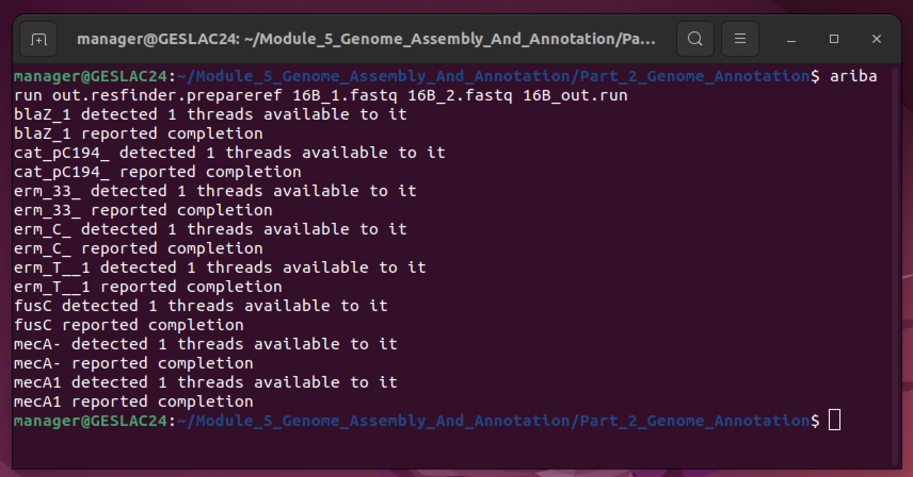
</p>

<br>

## Step 3: Run `ariba` on MW2

Repeat the `ariba` run on the MW2 fastq files. 

- Specify the directory containing the ResFinder database files
    - `out.resfinder.prepareref`
- Specify the 16B forward and reverse fastq files
    - `MW2_1.fastq MW2_2.fastq`
- Specify the the directory containing the results
    - `MW2_out.run`

<br>

```bash
ariba run out.resfinder.prepareref MW2_1.fastq MW2_2.fastq MW2_out.run
```

<br>

<p align="center">
    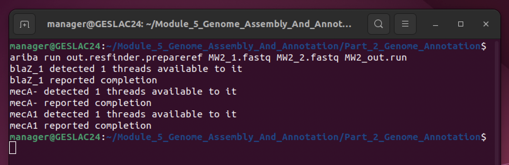
</p>

<br>

## Step 4: Run `ariba` on MSSA476

Repeat the `ariba` run on the MSSA476 fastq files.

- Specify the directory containing the ResFinder database files
    - `out.resfinder.prepareref`
- Specify the 16B forward and reverse fastq files
    - `MSSA476_1.fastq MSSA476_2.fastq`
- Specify the the directory containing the results
    - `MSSA476_out.run`

<br>

```bash
ariba run out.resfinder.prepareref MSSA476_1.fastq MSSA476_2.fastq MSSA476_out.run
```

<br>

<p align="center">
    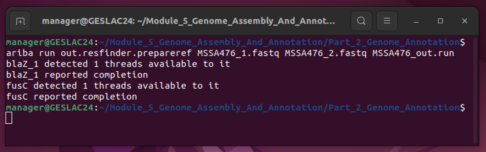
</p>

<br>


## Step 5: Compile the `ariba` results

Next you need to compile the `ariba` results from the three isolates using the the `ariba` `summary` command.

- Specify the prefix for the output files
    - `out.summary`
- Specify the report files made by the separate runs of `ariba` for each isolate 
    - `16B_out.run/report.tsv MW2_out.run/report.tsv MSSA476_out.run/report.tsv`

<br>

```bash
ariba summary out.summary 16B_out.run/report.tsv MW2_out.run/report.tsv MSSA476_out.run/report.tsv
```

<br>

We must now deactivate the `ariba` `conda` environment. Failure to deactivate the environment will prevent usage of downstream tools.

<br>

```bash
conda deactivate
```

<br>

## Step 6. Visualize in Phandango

The `ariba` summary command generates three files. You can see these in your directory with the `ls -l` command:

- `out.summary.csv` - summary of identifying genes and matches in the isolates 
- `out.summary.phandango.csv` - a version of summary file for viewing in Phandango
- `out.summary.phandango.tre` - tree based on matches in the out.summary.csv file

<br>

<p align="center">
    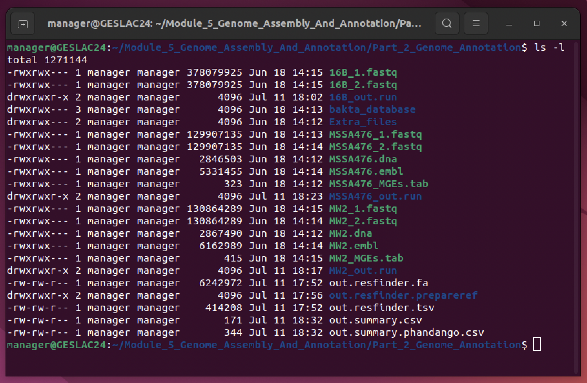
</p>

<br>

To visualize the results open up the Firefox web browser, and type in the URL: https://jameshadfield.github.io/phandango/

From a file view window drag and drop the two `phandango` files, `out.summary.phandango.tre` and `out.summary.phandango.csv`, into the browser window.

<br>

<p align="center">
    
</p>

<br>

In the browser window the tree is displayed on the left and represents relationships of the isolates based on the shared resistance determinants displayed in the right-hand panel, where the column indicate genes, and the green blocks indicate matches. The pink blocks indicate that the isolates are negative for those genes.

<br>

<p align="center">
    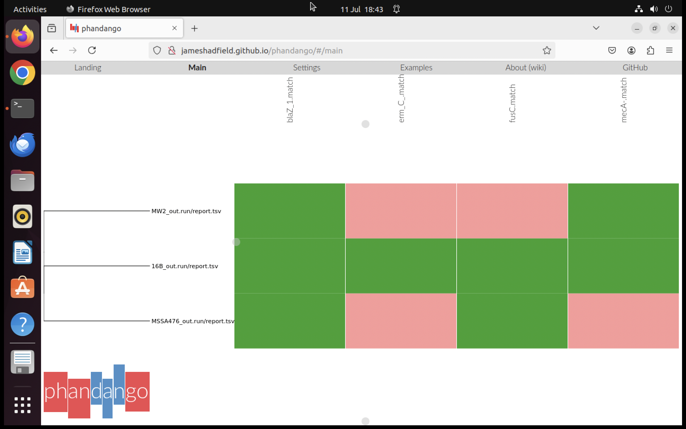
</p>

<br>

**What are the genes identified, and which antibiotics do they encode resistance for?**
To help you understand what what genes ResFinder is using for different antibiotics you can explore here: https://cge.food.dtu.dk/services/ResFinder/gene_overview.php
<input type="text" placeholder="Answer" style="width:100%; height: 30px;">

<br>

**How do the resistomes predicted for each isolate compare with the phenotypic data?**
You can find the resistance phenotypes here: [Resistance phenotype of 16B, MW2 and MSSA476](#resistance-phenotype-of-16b-mw2-and-mssa476)
<input type="text" placeholder="Answer" style="width:100%; height: 30px;">

<br>

# Generating a _de novo_ assembly

Having identified antibiotic resistance genes using `ariba`, you are now going to continue the exercise exploring the genome of 16B to identify the genomic context of the genes and see if you can find any missing genes. The first step is to generate a _de novo_ assembly of 16B using the `fastq` files. Make sure you are still in the `Part_2_Genome_Annotation/` directory.

To generate the _de novo_ assembly, you are going to use an assembly package called `Unicycler` (Wick et al., 2017, PLoS Comput Biol. 13(10): e1005595). `Unicycler` is a comprehensive assembly pipeline that uses `SPAdes` as its core assembler, offering seamless integration and better handling of bacterial genome assembly, especially with short reads and mixed read types (paired-end, long reads).

`Unicycler` simplifies the assembly process by combining several steps into one command and enhances the assembly with improved handling of repeat sequences and complex genomic regions. It uses a combination of de Bruijn graph and overlap-based assembly strategies, benefiting from SPAdes’ robust algorithm. For more details on Unicycler or the theory behind its usage, you can refer to the [Unicycler GitHub page](https://github.com/rrwick/Unicycler).

To perform the assembly, you will type a series of commands on the command line. Ensure that you type the commands carefully, as UNIX is case-sensitive and some command lines contain a lot of text. The input files for the Unicycler _de novo_ assembly are the `16B_1.fastq` and `16B_2.fastq` files that you previously used with `ariba`. The forward and reverse reads for the isolate 16B were generated using an Illumina HiSeq machine and are 75bp paired-end reads. The `Unicycler` package only requires a single command to process and assemble the reads into a genome. This command calls `SPAdes` internally and performs various additional steps to improve the quality of the final assembly.

<br>

## Step 7. Assemble 16B reads using `Unicycler`

The following parameters will be used when running `Unicycler`:

- Allocate 4 CPUs to the assembler:
  - `-t 4`
- Specify the kmer size to be used during the `SPAdes` assembly:
  - `--kmers 65`
- Specify the input paired-end reads in FASTQ format:
  - `-1 16B_1.fastq`
  - `-2 16B_2.fastq`
- Specify the directory into which results are written:
  - `-o S_aureus_16B`

Other parameters can be adjusted to optimise performance, but the default settings are generally adequate for most bacterial genome assemblies.

<br>

Run the `Unicycler` command:

<br>

```bash
unicycler -t 4 --kmers 65 -1 16B_1.fastq -2 16B_2.fastq -o S_aureus_16B
```

<br>

<b> `unicycler` may take 5 to 10 minutes to run. </b>

<br>

The `Unicycler` pipeline will handle all necessary steps, including error correction, contig assembly, and scaffold generation. It will print detailed progress and results to the screen. Once the assembly is complete, you will see output indicating the statistics of the assembly, similar to:

<br>

<p align="center">
    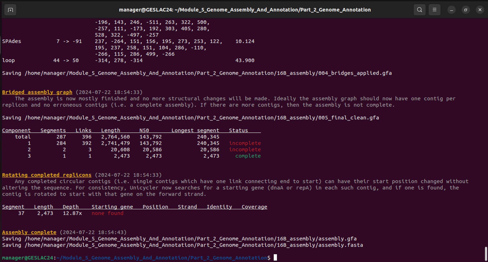
</p>

<br>

<!-- Maybe mention the number of contigs in each assembly graph. One graph contains most of the contigs. Two smaller graphs, one containing 2 contigs and one containing a single contig. The following section "Rotating complete replicons states that the contig which is 2,473 bp is circular, however a starting gene could not be identified." -->


All the results are written into the specified output directory, e.g., `S_aureus_16B`. Use the UNIX `cd` command to move into this directory, and the `ls` command to list the contents.

<br>

```bash
cd S_aureus_16B/
ls -l
```

<br>

<p align="center">
    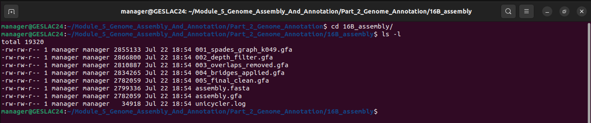
</p>

<br>

The final assembled contigs are in the `assembly.fasta` file. This file contains the contigs in multi-FASTA format, where each contig sequence is a separate FASTA entry. The `assembly.gfa` file provides a graphical representation of the assembly, useful for visualising the relationships between contigs. Other files in the directory provide detailed logs and metrics from the assembly process.

<br>

## Step 8. Assess the asembly quality using `QUAST`

We can gain a better idea of the quality of the assembly by calculating assembly statistics. In this example, we will use `QUAST`.

<br>

Run `QUAST` using the following parameters:

- Allocate 4 CPUs to the program:
  - `--threads 4`
- Specify the directory into which results are written:
  - `-o S_aureus_16B`
- Specify the assembly output file:
  - `assembly.fasta`

<!--

We can gain a better idea of the quality of the assembly by comparing the assembled contigs to the complete genome of a closely related strain. In this example, we will use `QUAST` to compare the assmebly of 16B to MSSA476.

Option to add:

- Specify the reference genome `MSSA476.dna` which we will compare our assembled contigs to. This is located in the parent directory `../`:
  - `../MSSA476.dna`
- Specify the input paired-end reads in FASTQ format:
  - `-1 16B_1.fastq`
  - `-2 16B_2.fastq`

-->

<br>

```bash
quast --threads 4 --output-dir quast.output assembly.fasta 
```

<br>

An interactive report will be produced `report.html` in the `quast.output` directory. This file summarises the assembly statistics and can be viewed in a web browser e.g. firefox:

<br>

```bash
firefox ./quast.ouput/report.html &
```

<br>

<p align="center">
    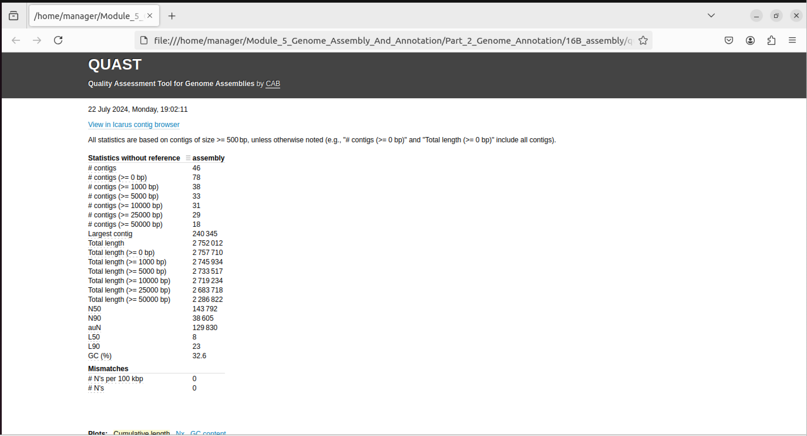
</p>

<br>

This output provides key metrics which give insights into the assembly quality and completeness: the number of contigs, the total length of the assembly, and the N50:

- **# contigs:** This line indicates the overall structure of the assembly. For example, it may show the number of scaffolds and contigs formed during the assembly process. Number of contigs of the size >= 500 bp. 
- **Total length:** This value represents the total size of the assembled genome.
- **N50:** The N50 statistic is a measure commonly used to evaluate the assembly quality. It represents the contig length such that 50% of the entire assembly is contained in contigs of at least this length. A higher N50 indicates a more contiguous and likely more accurate assembly.

<!--

Mention the GC content and how there are 3 contigs with a higher GC content. These are the same 3 contigs which are not part of the main assembly graph

<br>

<p align="center">
    
</p>

<br>

-->

<br>

At the top of the page, there is a link to view the genome in the **Icarus Contig Browser**. This provides a graphical representation of the assembly size, as well as the N50 and N90 highlighted. Zoom out for a view of the whole assembly. 

<br>

<p align="center">
    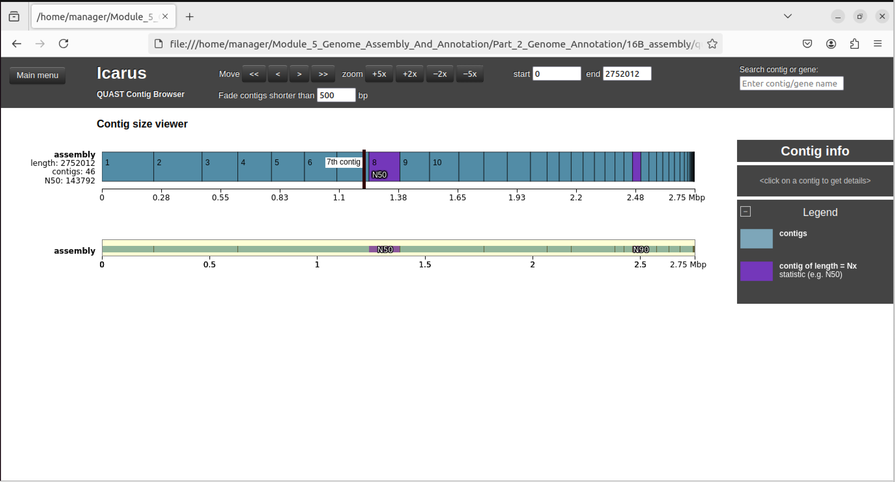
</p>

<br>

<br>

**How many contigs were assembled?**
<input type="text" placeholder="Answer" style="width:100%; height: 30px;">

<br>

**What is the N50 of your assembly?**
<input type="text" placeholder="Answer" style="width:100%; height: 30px;">

<br>

**What is the total length (bp) of your assembly?**
<input type="text" placeholder="Answer" style="width:100%; height: 30px;">

<br>

**How does this compare to the size of a typical S aureus genome (appriximately 2.8Mb). What percentage of the genome is likely covered?**
<input type="text" placeholder="Answer" style="width:100%; height: 30px;">

<br>

# Investigating genomic composition

Understanding the genomic composition of a newly assembled bacterial genome is a crucial step in genomic analysis. This investigation provides insights into the structure and organisation of the genome, revealing important information about the genetic elements present, such as genes, regulatory sequences, and mobile genetic elements. By examining the genomic composition, researchers can identify regions of interest, such as antibiotic resistance genes, virulence factors, and other functional elements that contribute to the bacterium's phenotype.

Additionally, analysing the genomic composition allows for the detection of genomic rearrangements, such as inversions, translocations, and duplications, which can have significant implications for bacterial evolution and adaptation. This step is essential for ensuring the accuracy and completeness of the assembly, as well as for understanding the biological and clinical relevance of the genomic features identified.

Following this investigation, the next step involves ordering the assembled contigs against a reference genome. This process helps in arranging the contigs into a more accurate representation of the genome, facilitating easier comparison with known sequences and aiding in the identification of structural variations and conserved regions. By aligning the contigs to a reference, we can better understand the genomic context and enhance the reliability of our subsequent analyses.

<!--
We are now going to use `Artemis` to explore the genomic composition of our assembly.

### What is Artemis?

`Artemis` is a genome viewer and annotation tool widely used in bioinformatics for visualising bacterial and archaeal genomes. It allows you to explore genome sequences, annotate genes, and analyse genomic features through an intuitive graphical interface.

To begin, open `Artemis` by typing `art &` on the command line of your terminal window and press return. Once the initial `Artemis` window appears, proceed to open the `assembly.fasta` file via *File* → *Open*.

Once opened, zoom out to view the entire sequence in your window. The individual contigs in the multi-FASTA file are alternately coloured orange and brown and displayed on the forward DNA line in the sequence view window. To obtain a summary of `assembly.fasta`, click *View*, then *Overview*. Here, you will see that there are 35 contigs in total (35 Number of features in active entry).

<br>

<p align="center">
    
</p>

<br>

### Exploring Genomic Composition

Next, we'll examine the GC Deviation plot to gain insights into the genomic composition of our assembly. From the *Graph* menu in `Artemis`, open *GC Deviation (G-C)/(G+C)* by clicking on the corresponding button. Adjust the plot to a suitable window size for this zoomed-out view by right-clicking on the graph, selecting *Maximum Window Size*, and choosing *20000*. Then, adjust the graph slider on the right-hand side of the screen to the bottom of the bar.

<br>

<p align="center">
    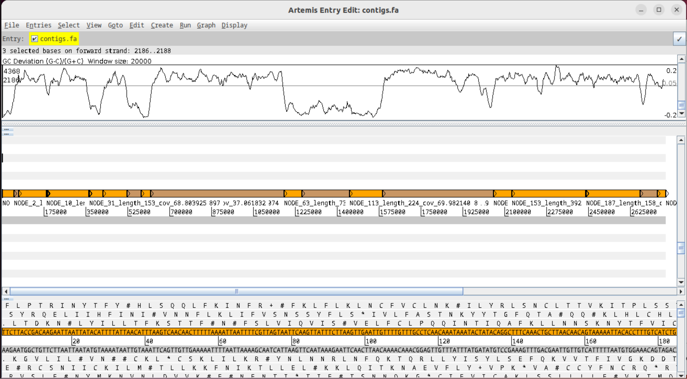
</p>

<br>

### Understanding GC Deviation

The GC Deviation plot shows variations across the assembly, with shifts typically occurring at contig boundaries. This variation in GC skew is influenced by differences in base composition between the leading strand (rich in G and T) and the lagging strand (rich in C and A) during DNA replication.

For comparison, refer back to the circular diagram of MSSA476 from earlier in the module, which illustrates the GC skew for its chromosome (the purple and olive inner plot on the figure). The origin and terminus of replication are positioned approximately halfway around the circular chromosome, creating distinct patterns of GC deviation. As you traverse the chromosome, the GC Deviation plot alternates between high and low levels, with shifts occurring after passing the origin or terminus of replication.

### Interpreting Assembly Structure

Examining the GC deviation plot in `Artemis` for the 16B assembly reveals multiple shifts from high to low levels. These shifts indicate that the contigs displayed in the assembly may not be arranged in the correct order or orientation relative to the true origin and terminus of replication of the 16B chromosome.
--------------->

## Step 9. Ordering the assembly against a reference genome using `abacas`

At the Wellcome Sanger Institute, a tool called `abacas` (Assefa _et al_., 2009) was developed to order contigs against a reference sequence. Any spaces between the contigs (gaps) can be filled in with “N” characters to ‘pad’ the sequence with equivalent sized regions to those on the reference that may be missing in the assembly. The result is called a pseudo-molecule. This is particularly useful for ordering fragmented contigs in a draft assembly against a well-assembled reference genome, thus providing a more contiguous representation of the genome.

The sequence we are going to use as a reference belongs to an ST1 MSSA strain, MSSA476 (EMBL accession number BX571857). Before we begin, make sure you are back in the `Part_2_Genome_Annotation` directory. To check where you are, use the UNIX `pwd` command. If you were in the `S_aureus_16B` directory, use the `cd ../` command to move into the parental directory.

The tool `abacas` uses `MUMMER` to map contigs to a reference genome. This process aligns contigs to their most similar regions in the reference genome, and it primarily aims to reconstruct the overall order and orientation of contigs to form a more complete genome assembly. 

We are going to reorder the 16B assembly against the MSSA476 reference using `abacas`. We do this by calling the `abacas.pl` script with the following parameters:

- Specify the reference sequence in a single fasta file
    - `-r MSSA476.dna`
- Specify the assembled contigs in multi-fasta format
    - `-q S_aureus_16B/assembly.fasta`
- Specify the MUMmer program to use: nucmer (for nucleotide-nucleotide comparison)
    - `-p nucmer`
- Specify the default nucmer parameters, which are faster
    - `-d`
- Specify the program to generate a bin of contigs that don’t map. This is very important
    - `-b`
- Specify the program to append contigs in bin to the pseudo-molecule
    - `-a`
- Specify the prefix for the output file name
    - `-o S_aureus_16B.ordered`

To see a complete list of the options available, you can type the command: `abacas.pl -h`

<br>

```bash
abacas.pl -r MSSA476.dna -q S_aureus_16B/assembly.fasta -p nucmer -d -b -a -o S_aureus_16B.ordered
```

<br>

The output to screen should look similar to what is shown below.

<br>

<p align="center">
    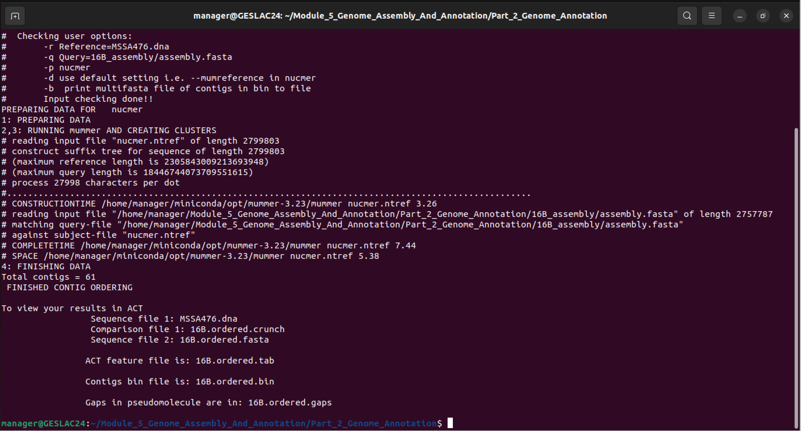
</p>

<br>

Several files are created by `abacas` and output into the `Part_2_Genome_Annotation` directory. These all have the prefix `S_aureus_16B.ordered`. You can view the contents of your current directory with the `ls` command. 

<br>

<p align="center">
    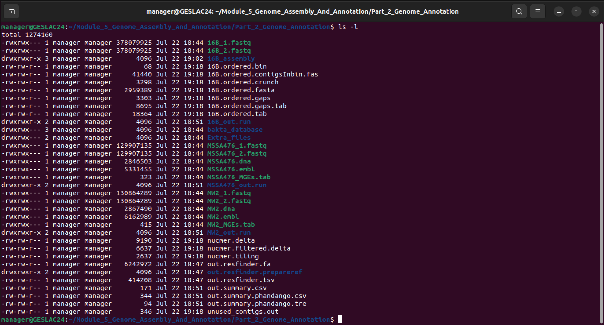
</p>

<br>

Of these output files, we will be using `S_aureus_16B.ordered.fasta`. This contains a single scaffold as the contigs have been joined by strings of Ns in the order at which they appear in the reference genome. As this is in fasta format, we can confirm the number of sequences in the output file as 1 by counting (`-c`) the number of lines in the file that begin with (`^`) `>` and represent a fasta header. `grep` is one way we can do this:

<br>

```bash
grep -c '^>' S_aureus_16B.ordered.fasta
```

<br>

## Step 10. Identify highly similar regions using `blastn`

Now that the contigs are ordered, the next step is to perform a detailed comparison to identify smaller matches between the ordered assembly and the reference genome. Local alignment focuses on finding regions of high similarity within by identifying the most similar subregions rather than aligning the entire length of the sequences. This is useful for finding and aligning functional domains, motifs, or regions of interest within larger, more varied sequences. It is also useful when aligning sequences of different lengths or when only specific parts of the sequences are expected to be similar.

To achieve this, we will use `blastn` to generate a more granular comparison. We will utilise the locally installed version of `blast` to perform this task.

First, we will run `formatdb` to format one of the sequences as a `blast` database:

- Specify the sequence type (protein: True or False). Ours is a DNA sequence, so we use F
    - `-p F`
- Specify the input sequence to format
    - `-i MSSA476.dna`

<br>

```bash
makeblastdb -in MSSA476.dna -dbtype nucl -out MSSA476
```

<br>

<p align="center">
    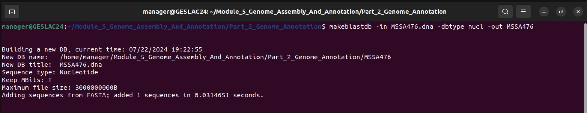
</p>

<br>

Next we will run `blastn` with the following parameters:

- Specify the query file
    - `-query S_aureus_16B.ordered.fasta`
- Specify the database file. This must be the file used for the `makeblastdb` command
    - `-db MSSA476`
- Specify the output file name
    - `-o MSSA476.dna_vs_16B.ordered.fasta.tsv`
- Specify the alignment output type. This option produces tabular output with one line per alignment and includes columns for query ID, subject ID, percentage identity, alignment length, mismatches, gap opens, query start, query end, subject start, subject end, e-value, and bit score.
    - `-outfmt 6`

<br>

```bash
blastn -query S_aureus_16B.ordered.fasta -db MSSA476 -out MSSA476.dna_vs_16B.ordered.fasta.tsv -outfmt 6
```

<br>

<p align="center">
    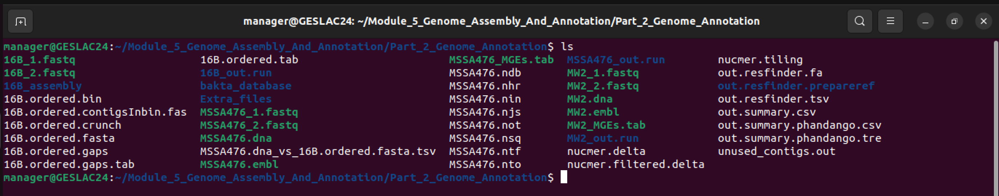
</p>

<br>

## Step 11. Explore local genomeic matches in `act`

We are now going to look at the `abacus` ordered 16B assembly in `act` with the `blastn` comparison file we have just generated.


We will run `act` with the following parameters:

- Specify the annotation file for the reference genome used (MSSA476):
  - `MSSA476.embl`
- The blastn result containing hits between MSSA476 and 16B
  - `MSSA476.dna_vs_16B.ordered.fasta.tsv`
- The ordered genomic assembly for 16B
  - `16B.ordered.fasta`

<br>

*******CHANGE ALL S_aureus.16B.ordered.fasta to 16B.ordered.fasta*******
*******CHANGE ALL S_aureus.16B.ordered.fasta to 16B.ordered.fasta*******
*******CHANGE ALL S_aureus.16B.ordered.fasta to 16B.ordered.fasta*******
*******CHANGE ALL S_aureus.16B.ordered.fasta to 16B.ordered.fasta*******
*******CHANGE ALL S_aureus.16B.ordered.fasta to 16B.ordered.fasta*******

```bash
act MSSA476.embl MSSA476.dna_vs_16B.ordered.fasta.tsv 16B.ordered.fasta &
```

<br>

<p align="center">
    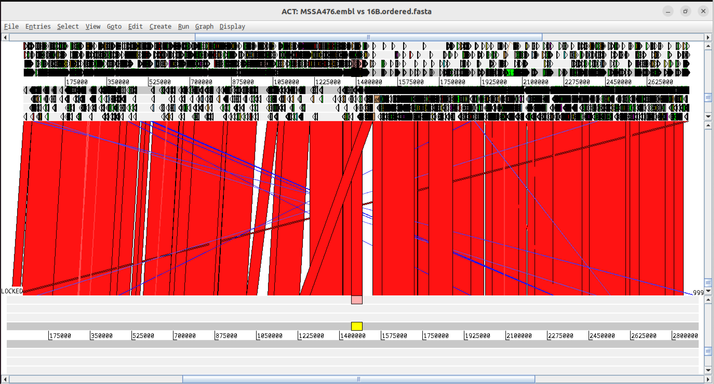
</p>

<br>

Once the `act` window loads up, open `16B.ordered.tab` file into the `16B.ordered.fasta` entry by going to the *File* menu, and selecting the *16B.ordered.fasta* option, and right clicking onto the *Read An Entry* option. 

Once ACT has opened, zoom out so you can see the whole of the sequences (you may have to re-size the ACT window) and reduce the size of the BLASTN footprint that is displayed, by moving the slider on the right-hand side of the comparison window down to the bottom of the bar.

As before, display the GC Deviation (G-C)/(G+C) plots for both of the sequences (under the Graph menu there will be two sequences, top and bottom sequences, click on each to open the graphs for each). Remember to rescale the plot for a more appropriate window size (use 20000 as before, then move the graph slider of the right hand side of the screen down to the bottom of the bar).


<br>

<p align="center">
    
</p>

<br>

<br>

**QUESTION?**
EXTRA CONTEXT
<input type="text" placeholder="Answer" style="width:100%; height: 30px;">

<br>

**QUESTION?**
EXTRA CONTEXT
<input type="text" placeholder="Answer" style="width:100%; height: 30px;">

<br>

In the `act` figure there are several regions of interest that are worth investing. The first region we are going to look at is the inverted region in the centre of the assembly that is covered by the hourglass shaped blue matches in the comparison panel. This 130 kb region spans the terminus of replication region, and is present at one end of a contig. At the other end of the putative inverted region there is a contig break. 

*******ADD FURTHER DETAILS*******

<br>

<p align="center">
      
</p>

<br>

<br>

**QUESTION?**
EXTRA CONTEXT
<input type="text" placeholder="Answer" style="width:100%; height: 30px;">

<br>

**QUESTION?**
EXTRA CONTEXT
<input type="text" placeholder="Answer" style="width:100%; height: 30px;">

<br>

## Step 12. Mapping reads back to the ordered assembly using `snippy`

<br>

****The `snippy` process takes approximately 20 minytes - Move to earlier in the practival for results to be analysed at this point****

<br>

In this next exercise you are going to use the same mapping method as you did in Mapping Module, to map the 16B strain forward and reverse reads against the pseudo-molecule that you created using `abacas`. We are then going to look at the aligned mapped reads in `act` by loading the mapped bam file with the `16B.ordered.fasta`.  

First we will run `snippy` with the following parameters:

- Specify the output directory
    - `--outdir 16B_mapping`
- Specify the forward read
    - `--R1 16B_1.fastq`
- Specify the reverse read
    - `--R2 16B_2.fastq`
- Specify the reference sequence to map to
    - `--ref 16B.ordered.fasta`
- Specify the number of cpus
    - `--cpus 4`
- Specify the amount of ram
    - `--ram 4`
- Specify overwriting existing file 
    - `--force`
- Specify no screen output 
    - `--quiet`

<br>

```bash
snippy --outdir 16B_mapping --R1 16B_1.fastq --R2 16B_2.fastq --ref 16B.ordered.fasta --cpus 4 --ram 4 --force --quiet
```

<br>

This produces a number of files, including: **COMPLETE**

To load the `bam` file into `act`, click *File* on the menu and them click the *16B.ordered.fasta* entry, and then the *Read BAM / VCF*.

In the pop-up box click *Select*, select the `snps.bam` file from the `16B_mapping` directory, click *Open*, then click *OK*.

<br>

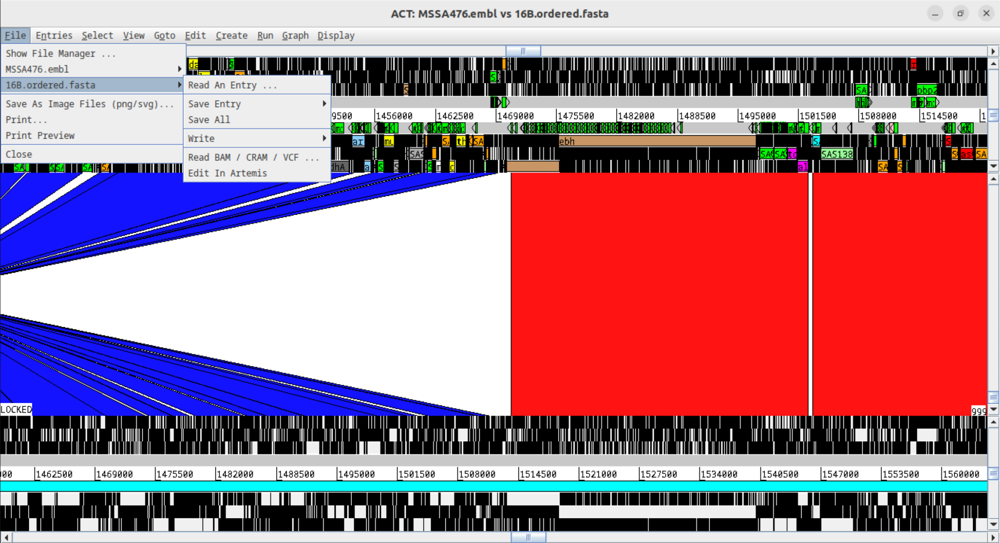

<br>

If you are not already there, go to the inversion region, and the inversion point in the contig (the region below illustrated in the image). You should see the BAM view as a panel at the bottom of the screen.

<br>

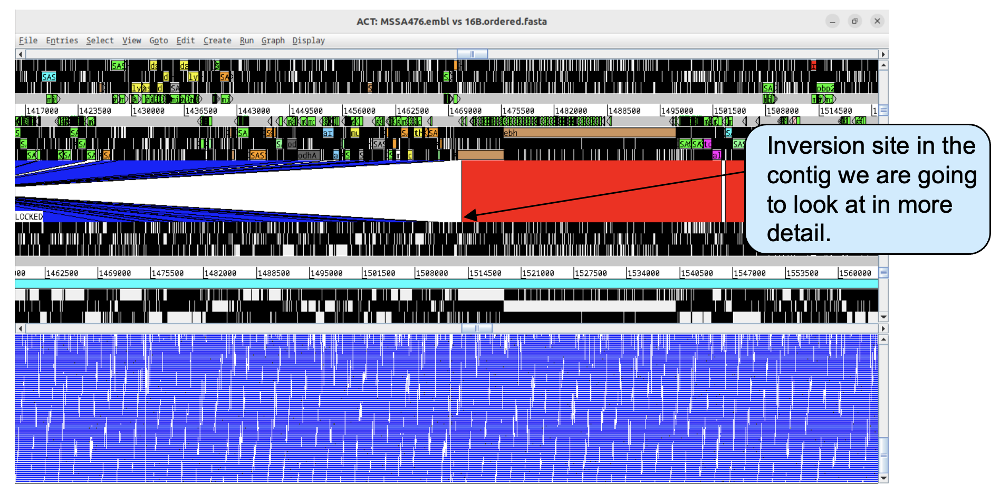

<br>

Zoom in further keeping the inversion site in the centre of the ACT screen.  

<br>

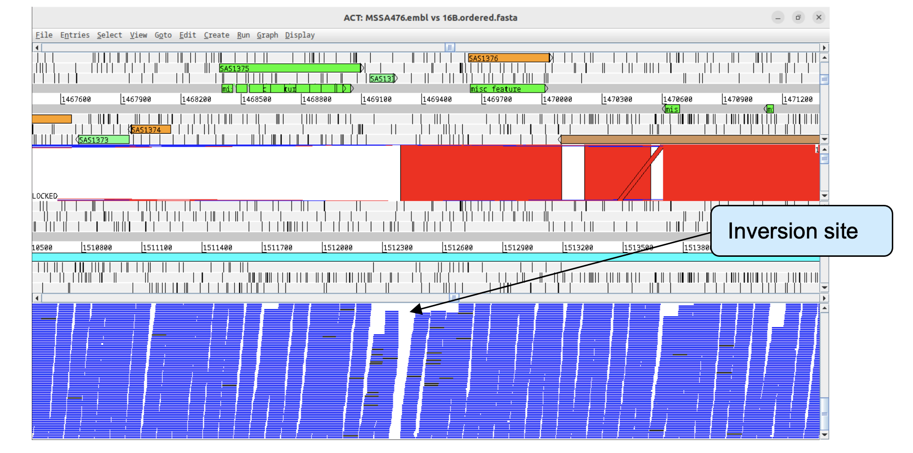

<br>

The reads in the BAM view appear to break at the junction of the inversion indicated by the `blasts` match; no reads span the junction point (click on the reads around the junction to see their pair) suggesting that there may be problems with the assembly of the 16B DNA across this region. 

To get another perspective of the mapping to this region, change the BAM view to show the inferred size of the insert. To do this right click on the BAM view window, move the cursor over *Views*, and click *Inferred Size*.

<br>

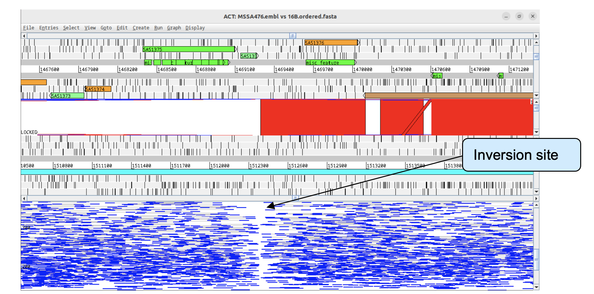

<br>

From the inferred size view you can see that there are no reads with predicted inserts that span this region. This suggests that the inversion may not be present, and that the sequence generated by Velvet in this region has not assembled correctly, and needs further investigation. To check if this is a mis-assembly, you could change the parameters of the original Velvet runs, or alternatively design PCR primers and do a PCR to check for the orientation of this region in the genomic DNA.

<br>

In addition to allowing us to check for potential mis-assemblies we can also use the mapping data to look for copy number variants in the assembly.

In `act` change the read view back to *Stack view*, and zoom out to see the whole sequence

<br>


<br>

From this view in `act` you can see that the average coverage across the whole 16B sequence is about 120 fold, and that there is subtle reduction in coverage from the origin to the terminus of replication. You can also see that the non-mapping sequences from the bin at the right-hand side of the sequence have a higher level of coverage than the rest of the sequence that matches to the MSSA476 chromosome.

Zoom into this region to look in more detail.

<br>


<br>

The non-mapping contigs are indicated by the yellow features. There are 7 contigs and the two larger sequences are 20.6 kb and 2.5 kb. The read coverage across these regions increases considerably from the average (120 fold), to about 400 fold for the 20.6 kb contig, and 1400 fold for the 2.5 kb contig. It is therefore likely that these two contigs are separate multicopy plasmids that are part of the 16B genome.

<br>

# Generating the genome annotation

Now we have the contigs ordered against the reference, and have mapped back the reads to identify a possible mis-assembly, and also identified putative plasmid sequences. However we are still not yet in a position to drill down into the biology of the strain. For this we need to add some annotation to the newly assembled genome. 

There are a number of ways you can generate annotation for a novel sequence. You can manually annotate sequence by curating the results of bioinformatic analyses of the sequence, but this is time consuming and prone to human bias. If there is a closely related reference sequence and annotation, you can transfer annotation by similarity matching, but this relies on there being a suitable reference. The fastest and most consistant way to generate annotation for novel sequence is to use an automatic annotation software such as `prokka` (Seemann T. (2014) Prokka: rapid prokaryotic genome annotation. Bioinformatics. 30:2068-9. doi: 10.1093/bioinformatics/btu153) or `bakta` (Schwengers O et al., (2021). Bakta: rapid and standardized annotation of bacterial genomes via alignment-free sequence identification. Microbial Genomics, 7(11). https://doi.org/10.1099/mgen.0.000685)

Both of these program are installed on the disk image, but we are going to use `bakta` as this is a new tool that generates standardized, taxonomy-independent, high-throughput annotation.

There are two steps in running `bakta`, the first is downloading a database for it to use for annotation, the second is to run the `bakta` annotation on a query sequence using the database. The downloading step takes a while to run (it involves download a file of ~1.6 Gb), so we have already down loaded is for you. 


## Step 13. Genomic annotation using `bakta`


To run `bakta` to annotate your sequence.

- Specify the database directory
    - `--db bakta_database/db-light`
- Specify the multifasta file to be annotated
    - `16B.ordered.fasta`


```bash
bakta --db bakta_database/db-light 16B.ordered.fasta
```

<br>


The first step of `bakta` is to annotate non-protein encoding regions including tRNAs, tmRNA, rRNA, ncRNA.

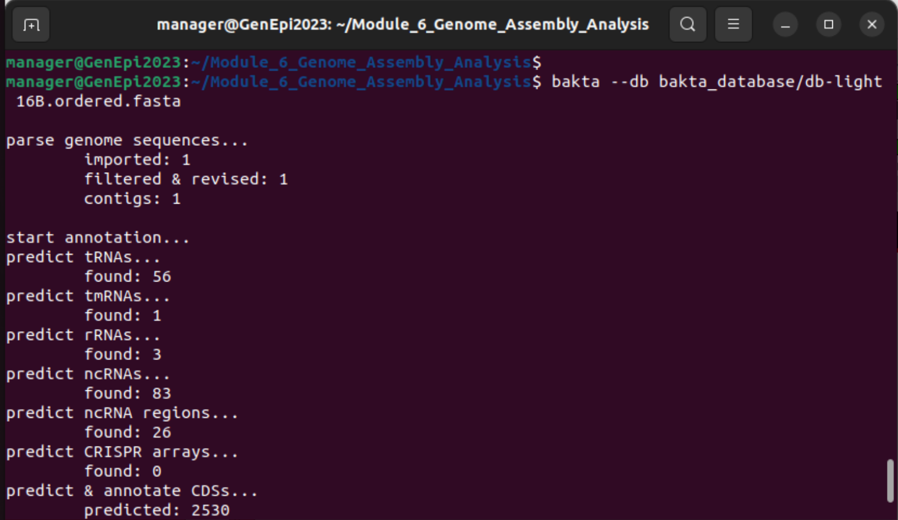


<br>


It then predicts protein coding sequences and annotates these from match to proteins with predicted function, and includes annotation of hypothetical proteins with matches to protein domains


<br>


Matches to plasmids origins of replication are included where found and provides a summary of the genomic annotation.


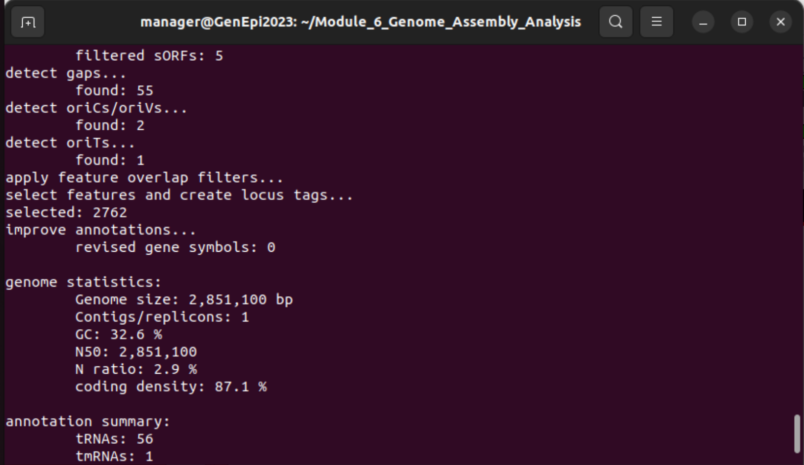


<br>


The results are written to multiple output files in the directory in which `bakta` was run.


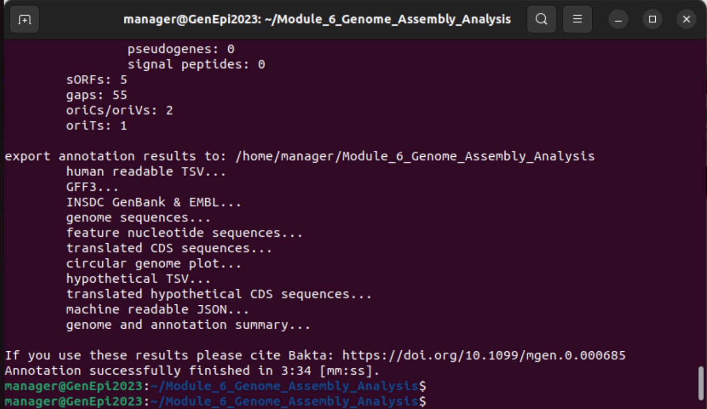


<br>


For more information on the annotation generated by `bakta`, the run options and the output it generates see here: https://github.com/oschwengers/bakta   


## Step 14. Visualizing the `bakta` annotation


`bakta` has generated a number of output files in different foramt that contain the annotation for 16B ordered assembly. We are going to use the EMBL format file and view it in ACT. 

In ACT, open the `16B.ordered.embl` file into the `16B.ordered.fasta` entry by going to the *File* menu, and selecting the *16B.ordered.fasta* option, and right clicking onto the *Read An Entry* option. 


<br>

### Region 1 <!-- omit in toc -->


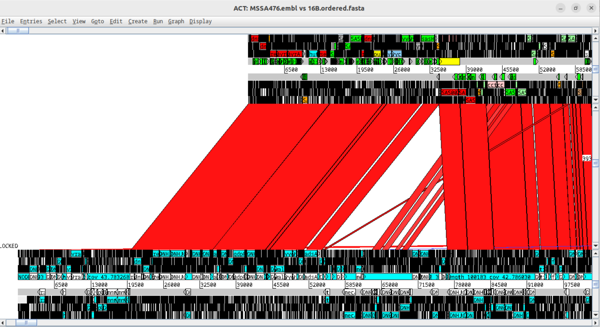


In this region near at the left hand side of the reference chromosome and near the origin of replication, you can see that this contig spans the origin of replication and therefore matches two separate regions of the reference (left and right ends of the MSSA476 chromosome). 

Beyond the origin of replication there is a second region that is a novel indel region in 16B. The region spans two contigs. This ~22 kb region, contains `blastn` hits in the middle of the sequence, that match sequence in the MSSA476 reference (top) that is also present in the 16B assembly. This suggest that the ~22 kb region shares some similarity with the region downstream. 

- Have a look at the annotation generated by `bakta` of the CDSs in this region in 16B. 
- What sort of functions do the proteins in this region encode? 
- Have a look at the annotation of the CDSs in the MSSA476 reference that match this regions. 
- What do you the identity of this region is?
- Can you find any genes of interest for antibiotic resistance that `ariba` identified?
<br>


### Region 2 <!-- omit in toc -->


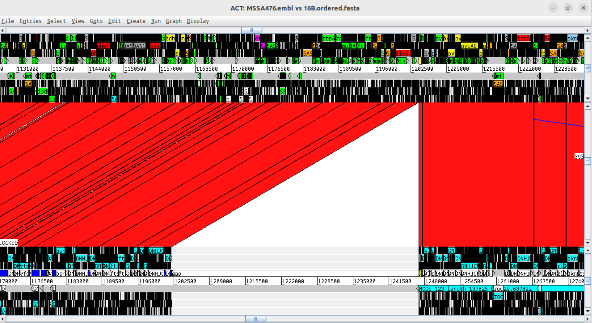


From the `act` figure it would appear that there is a large insert in the 16B assembly relative to the MSSA476. If you zoom in and look at the sequence you will see that is composed of Ns rather than bases (in the figure you can make out regions with Ns, as they do not have any black lines that indicate stop codons on the forward and reverse translations). In this case ABACAS has mis-predicted a gap in this region, and therefore `bakta` has not  annotation this region as it does not contain sequence.

<br>


### Region 3 <!-- omit in toc -->


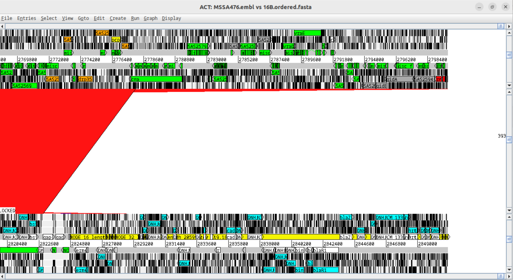


In this region near at the right hand side of the assembly, we have the non-mapping contigs (yellow). Previously we have seen that the two largest contigs are likely to be separate plasmids. 

- Have a look at the annotation generated by `bakta` of the CDSs of the contigs in this region. 
- What sort of functions do the proteins in this encode? 
- Does the annotation confirm them as plasmids?
- Can you find any genes of interest for antibiotic resistance that `ariba` identified?


<br>


# Examining the evolution of drug resistance in ST1 _S. aureus_


Up until now we have compared the 16B assembly to only one other ST1 _S. aureus_ strain, MSSA476. We are now going introduce another strain to the comparison, MW2, and start looking at the genetic differences between the isolates that may impact on their biology. Although MW2 was isolated in a different country (USA), many thousands of miles away from 16B and MSSA476 (both UK), it still belongs to the same clone, and probably share a common ancestor tens rather than hundreds of years ago. A clinically important phenotypic difference between these isolates are their antibiotic resistances:

- 16B – penicillin<sup>R</sup>, fusidic acid<sup>R</sup>, methicillin<sup>R</sup>, erythromycin<sup>R</sup>
- MSSA476 – penicillin<sup>R</sup>, fusidic acid<sup>R</sup>
- MW2 – penicillin<sup>R</sup>, methicillin<sup>R</sup>

As you will hopefully have just discovered, it is possible to use genome sequence data to find the genes responsible for antibiotic resistance. Examining the genetic context of these genes helps us to understand the mechanism that are driving the evolution of resistance in these _S. aureus_ isolates. In this next part of the Module you are going use the comparisons with MW2 and MSSA476 to identify regions of difference regions that distinguish the isolates, and explain the differences in the antibiotic resistance phenotypes.

<br>

Before we begin this exercise close down any `act` session you have open.

## Step 15.

In order to examine the regions of difference in the 16B assembly with MW2 we are going generate a comparison file that we can load in ACT, as we did previously for MSSA476.

At the prompt type and return the command line:

```bash
formatdb -p F -i 16B.ordered.fasta
```


Next type and return the command line:

```bash
blastall -p blastn -m 8 -d 16B.ordered.fasta -i MW2.dna -o 16B.ordered.fasta_vs_MW2.dna
```


We are now going to load up the three sequences and relevant comparison files into `act`. You can do this either from the command line or by clicking on the ACT icon. 


If you prefer to do it from the command line you can type:

```bash
act MSSA476.embl MSSA476.dna_vs_16B.ordered.fasta.tsv 16B.ordered.embl 16B.ordered.fasta_vs_MW2.dna MW2.embl &
```

<br>


Now that you have included the MW2 sequence to the comparison you should see an `act` view with three DNA panels and two comparison panels separating them. In this zoomed out view, MSSA476 is on the top, 16B is in the middle and MW2 on the bottom. You will also notice that in the `act` menu at the top there are now three entry options. 


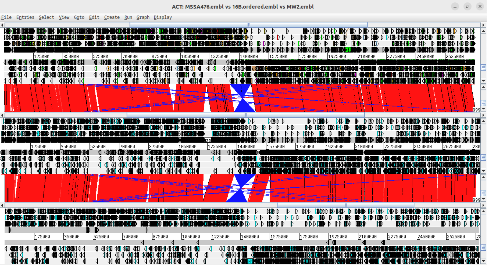


To help you with your investigations, we have also provided two additional annotation files that contain misc_features which mark the extent of MGEs identified in the MSSA476 and MW2 chromosomes. These can be loaded into the appropriate entry (from the menu click *File*, the entry you want, then *Read An Entry*). The misc_features are colour coded in the ACT view according to the type of MGE (see legend on on the circular diagram of MSSA476).


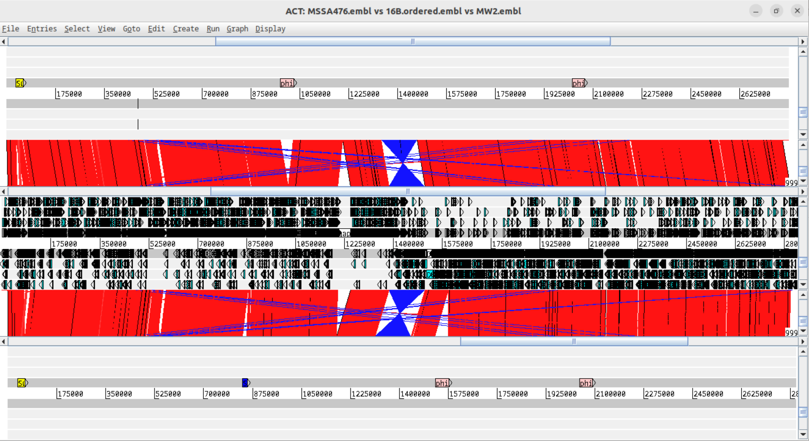


Here is the Region 1 that we have looked at previously, now with MW2 at the bottom. The regions of 16B that lacking annotation transferred from MSSA476, contains a matches to a region of the MW2. Does the identity of this MW2 region correspond to what you have seen from the NCBI BLAST searches? What has occurred in this region of the 16B chromosome that could explain the structure of this region in comparison to the other strains?


Compare the other regions containing MGEs. 

- How do these regions vary in the three strains, and what do they encode? 
- Does this explain the differences in the antibiotics phenotypes of the isolates? 
- Can you find any other important genes associated with MGEs that are vary in the isolates that are clinical relevant (clue, think toxins).


<br>

<br>

[>>> Go to Assembly Method Comparison Exercise](https://github.com/WCSCourses/GenEpiLAC2024/blob/main/Manuals/Assembly_method_comparison/Assembly_method_comparison.md)

[<<< Go back to Manual Contents Page](https://github.com/WCSCourses/GenEpiLAC2024/blob/main/Manuals/Manual_main.md)

<br>

