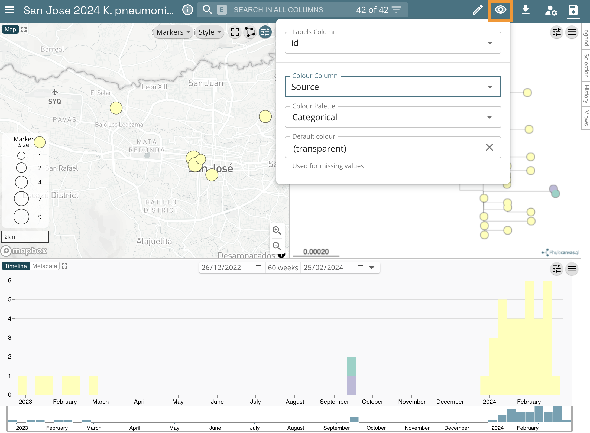
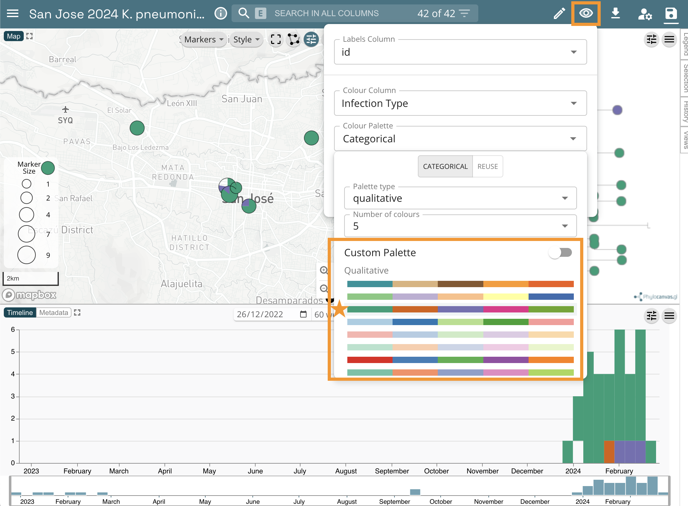
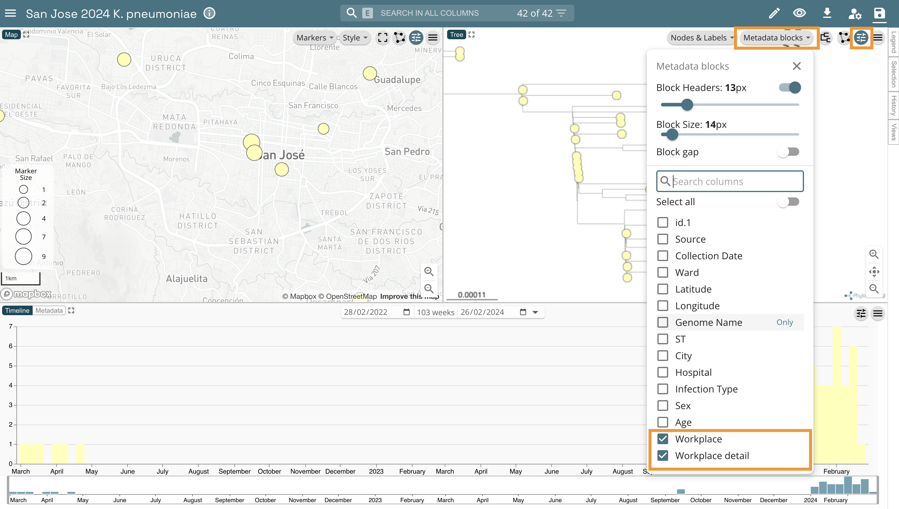

[<<< Go back to Manual Contents Page](https://github.com/WCSCourses/GenEpiLAC2024/blob/main/Manuals/Manual_main.md)

# Web tools for genomic epidemiology

### Module Lead: Julio Diaz Caballero & Caterina Guzmán Verri

# Table of contents

-   [Background](#background)
-   [Introduction](#introduction)
-   [Objectives](#objectives)
    -   [Collect field data with Epicollect](#collect-field-data-with-epicollect)
    -   [Analyse genomes with PathogenWatch](#analyse-genomes-with-pathogenwatch)
    -   [Merge data with Data-flo](#merge-data-with-data-flo)
    -   [Explore phylogenetic and epidemiological data with Microreact](#explore-phylogenetic-and-epidemiological-data-with-microreact)
-   [Resources](#resources)
    -   [Install and test Epicollect5 on your mobile phone](#install-and-test-epicollect5-on-your-mobile-phone)
    -   [Sign-in to data-flo](#sign-in-to-data-flo)
    -   [Sign-in to Microreact](#sign-in-to-microreact)
    -   [Web colours](#web-colours)
-   [Bonus activities](#bonus-activities)

# Background

Genomic epidemiology aims to understand the emergence and dissemination of high-risk clones within pathogen populations with the ultimate goal of implementing evidence-based interventions to protect public health. High-risk clones are subpopulations/strains/variants of a pathogen that carry risk elements, such as antibiotic resistance or virulence determinants, and thus pose a potential risk to public health.

The increased genetic resolution afforded by genomic data is useful from global to local geographic scales, and has proven to be particularly useful for the investigation of pathogens that exhibit little genetic variation (e.g. [Wong *et al.* 2016](https://pubmed.ncbi.nlm.nih.gov/27703135/)), and for outbreak investigations (e.g. [Hendriksen *et al.* 2011](https://pubmed.ncbi.nlm.nih.gov/21862630/), [Eppinger *et al.* 2014](https://pubmed.ncbi.nlm.nih.gov/25370488/)). During outbreak investigations (and other genomic epidemiology studies), epidemiological data from patients is collected by healthcare professionals. Antimicrobial susceptibility data, species identification, and any further phenotypic or molecular characterization of the isolates is often generated by the laboratories linked to healthcare facilities and/or by the reference laboratory. Ideally, these different sources of data are stored in a centralised surveillance system and database, such as WHONET. However, these systems rarely incorporate genomic data produced by bioinformaticians. Genomic data may include sequence/assembly quality, genotyping/genoserotyping information, presence/absence of known risk elements, and clustering of the isolates based on genetic similarity --usually in the form of a phylogenetic tree or a minimum spanning-tree.

The job of a genomic epidemiologist often starts by combining data from diverse sources that might not be complete or standardised to facilitate the identification of relevant patterns for meaningful interpretation. Once integrated, the epi, lab, and genomic data can be interrogated over the structure of the tree to identify clusters of interest that will place the isolates in or out of the outbreak.

The [**Centre for Genomic Pathogen Surveillance**](https://www.pathogensurveillance.net/our-software/) develops free web applications for data collection, integration, visualisation, and analysis of genomic epidemiology data. [**Epicollect5**](https://five.epicollect.net/) is a mobile & web application for free and easy data collection. It provides both the web and mobile applications for the generation of forms (questionnaires) and freely hosted project websites for data collection. Projects are created by using the web application at [five.epicollect.net](five.epicollect.net), and then downloaded to the device to perform the data collection. Data are collected in the field using multiple devices and all data can be viewed on a central server (via map, tables, and charts). [**Data-flo**](https://data-flo.io/) is a system for customised integration and manipulation of diverse data via a simple drag and drop interface. Data-flo provides a visual method to design a reusable pipeline to integrate, clean, and manipulate data in a multitude of ways, eliminating the need for continuous manual intervention (e.g., coding, formatting, spreadsheet formulas, manual copy-pasting). [**Microreact**](https://microreact.org/) allows you to upload, visualise and explore any combination of clustering (trees), geographic (map) and temporal (timeline) data. Other metadata variables are displayed in a table. You can specify colours and/or shapes to display on the map, tree and/or timeline. A permanent URL is produced for you to share your Microreact.

# Introduction

Aim: To use web and mobile tools for the collection of epi data in the field, integrate epi data with lab and bioinformatics data, and visualise all data together to investigate a putative outbreak.

*Note: This exercise is a work of fiction. Any resemblance to a real life situation is purely coincidental.*

During January and February 2024, *Klebsiella pneumoniae* was isolated from clinical samples of 34 patients at several hospitals and clinics in and around San Jose, Costa Rica. Approximately half of the patients had presented with urinary tract infections (UTIs) although a variety of other infection types were seen including three sepsis cases. One colony from each confirmed case was sequenced on an Illumina MiSeq. An epidemiological investigation revealed that some of the culture-confirmed cases ***were faculty at a Universidad de los Estudios para la Pura Vida (UEPV) in San Jose***. This suggested that the campus may be the central point of transmission in this outbreak. The epidemiological and demographic data is summarised in the file [epi_data.csv](https://drive.google.com/file/d/1bQzfkoO-z8YXEZ9sdCPuv59qHK9tKwzf/view?usp=sharing).

**Following the confirmation of the 34 positive cases of *K. pneumoniae* ST258 infections, the management of UEPV denied that the Klebsiella pneumoniae could have spread within the campus and declared that deep cleaning of the was taking place regularly.**

**A team of disease detectives will be deployed around UEPV today to investigate the possibility of environmental contamination of *K. pneumoniae* within the campus**, using Epicollect5, data-flo, Pathogenwatch, and Microreact, free mobile and web applications developed by the Centre for Genomic Pathogen Surveillance for easy data collection, analyses, integration and visualisation.

# Objectives

At the end of this session the participants will be able to:

1.  Collect data in the field with Epicollect5.
2.  Analyse genomes using PathogenWatch
3.  Merge epidemiological, laboratory and genomic data with data-flo
4.  Create a Microreact project to visualise epidemiological, laboratory and genomic data

## 1. Collect field data with Epicollect

`https://five.epicollect.net/`

The disease detectives will work in pairs, and will be provided with a **collection tube** with a **barcode** sample identifier to collect a surface or water sample, and will use their **mobile phone** to collect associated metadata in the field.

Make sure your phone is connected to WiFi. Open the **Epicollect5** app on your mobile phone.

Add the project **San Jose 2024 K pneumoniae Outbreak** by clicking on `+ ADD PROJECT` and typing into the search box --you will need to be connected to WiFi.

Using the plan of the UEPV campus provided, walk to the location of your collection point. Locations are indicated by the black dots labelled a-j. You will not need internet access to collect data in the field.

Open the **San Jose 2024 K pneumoniae Outbreak** project and add an entry. Follow the form to collect a sample and associated metadata.

Your team will collect only one sample, but both of you can collect the associated data on Epicollect5. However, *make sure that only one of you uploads the data later on to avoid duplications.*

Return to the Epidemic Intelligence Center (i.e. the classroom).

One of the pair members only. **Upload your entry (and image)** to the Epicollect5 server --make sure you are connected to the WiFi.

Submit your sample to the instructor, which will be sent to the reference lab for culture confirmation.

Once all entries are uploaded by the disease detectives we will take a look at the data together on [**https://five.epicollect.net/project/san-jose-2024-k-pneumoniae-outbreak**](https://five.epicollect.net/project/san-jose-2024-k-pneumoniae-outbreak)

Answer the following questions:

> 1.  What is the most common type of source?
> 2.  Was it possible to collect a sample from all sources? If not, what were the reasons?

## 2. Analyse genomes with PathogenWatch

The reference lab has sent you the culture results in an Excel file called ([`lab_results.xlsx`](https://docs.google.com/spreadsheets/d/1kNerfOJUf-93jSLKioGHKuao4J7DHJPC/edit?usp=sharing&ouid=109151314762498412799&rtpof=true&sd=true)). The lab reported that **2 out of 13** water samples from the UEPV campus were positive for *K. pneumoniae*. **This immediately prompted the closure of the 2 water sources and internal investigation.**

> Does this confirm that the source of the outbreak can be found in the campus of UEPV?

One colony from each source was sequenced on Illumina MiSeq by the reference lab and the bioinformatics team has assembled each of them. We will use [**https://pathogen.watch**](https://pathogen.watch) to identify the sequence type (ST) of these genomes using the Pasteur scheme.

Click on the upload link at the top right

Click on `Single Genome FASTAs`

Drag and Drop provided fasta files ([file1](https://drive.google.com/file/d/1c73Bt4W108ww0_zmJHugYJiR6Bg5SGoc/view?usp=sharing) and [file2](https://drive.google.com/file/d/1VGjW_8YmmUo_Lg1S_AJUhHWhUbKLtSqm/view?usp=sharing)) into the browser and wait for analysis to finish

Click on `VIEW GENOMES`

Select the two analysed genomes

Click on `Selected Genomes`

Click on Download data

Click on MLST (Pasteur). This will download a csv file with the results.

You should now be able to find the [`mlst-Pasteur.csv`](https://drive.google.com/file/d/1MGp4g_lTXBoNWno_VO44PVNuTGxCbiqq/view?usp=sharing) in your `Downloads` folder.

## 3. Merge data with Data-flo

`https://data-flo.io/`

*Note: you need to sign-up for data-flo and Microreact. See instructions in the [Resources](#resources) section. Creating your own account will allow you to manage and edit your projects.*

A maximum likelihood phylogenetic tree ([`tree.nwk`](https://drive.google.com/file/d/1iE7V2p3Ga-Br6RfL3V32Etn7IPvUglUE/view?usp=drive_link)) was inferred from the genomes of the 34 clinical samples and 2 environmental (water) samples. Six genomes from a previous outbreak (Mar-Apr 2022) were also included in the tree inference and their associated data added to the [`epi_data.csv`](https://drive.google.com/file/d/1bQzfkoO-z8YXEZ9sdCPuv59qHK9tKwzf/view?usp=drive_link) file.

The disease detectives now have the information needed for the investigation in the following formats:

-   [`epi_data.csv`](https://drive.google.com/file/d/1bQzfkoO-z8YXEZ9sdCPuv59qHK9tKwzf/view?usp=drive_link) Epi data from 34 clinical cases and 6 cases from previous outbreak
-   `Epicollect project` Metadata of 13 water sources from the UEPV campus
-   [`lab_results.xlsx`](https://docs.google.com/spreadsheets/d/1kNerfOJUf-93jSLKioGHKuao4J7DHJPC/edit?usp=drive_link&ouid=109151314762498412799&rtpof=true&sd=true) Culture and serotyping results
-   [`mlst-Pasteur.csv`](https://drive.google.com/file/d/1MGp4g_lTXBoNWno_VO44PVNuTGxCbiqq/view?usp=drive_link) MLST results from PathogenWatch
-   [`tree.nwk`](https://drive.google.com/file/d/1iE7V2p3Ga-Br6RfL3V32Etn7IPvUglUE/view?usp=drive_link) Phylogenetic tree of 34 clinical cases, 2 culture-positive water samples, and 6 cases from previous outbreak

The files are located in [**this link**](https://drive.google.com/drive/folders/1LH2beqwn5IeB7veScPLrlI6qmbgAaM2J?usp=drive_link).

We will combine data from these different sources with a data-flo workflow that takes the files above and the data from the Epicollect project as input, and creates as an output a Microreact project where the data can be visualised.

Open the data-flo workflow ([**[https://data-flo.io/run?wbhznSXSn3qAomUnGrXesx](https://www.data-flo.io/run/7QcjMyGh55rqckNjbkYv3h)**]

Copy the workflow to your own dataflo account.

This will open a copy of this workflow in your dataflo account.

**On a different browser tab**, get your microreact `API access token` at [**https://microreact.org/my-account/settings**](https://microreact.org/my-account/settings) (you must already have created your microreact account).

 

Edit the workflow to include your own microreact `API access token`.

1.  Click on `*access token` in the `Create microreact project` box
2.  From the options on the right, select `Bind to value`
3.  Paste your `API access token` in the `VALUE` box 

Save your newly edited dataflo project by clicking on the `save` icon.

Now lets go to the implementation page by clicking on the `RUN` option.

To run the workflow paste the url of the Epicollect5 project ([**https://www.data-flo.io/run/7QcjMyGh55rqckNjbkYv3h**](https://www.data-flo.io/run/7QcjMyGh55rqckNjbkYv3h)) and upload the files, found [`here`](https://drive.google.com/drive/folders/1zcrHcTf2ZXY_CHFcOSyTtLFVgJjrnXgl?usp=drive_link)`(file1 and file2)`.

Click on **`Run`**. The Outputs box now shows the url of a Microreact project created by data-flo.

Before you open the Microreact project answer the following questions:

> 1.  If later on we wanted to add additional entries (i.e. water samples) to the Epicollect project, could we use the same data-flo? If so, how would this be beneficial?
> 2.  Do you use/know of any other methods to join data? If so, how do they compare with data-flo?

## 4. Explore phylogenetic and epidemiological data with Microreact

`https://microreact.org/`

Open the Microreact link in the output from data-flo. It should look something like this:

Now change the colour column to "Hospital". Click on the eye icon at the top right of the page. Select "Hospital from the `Colour Column` dropdown list.

Scale the markers on the map by clicking on the sliders icon, then in the opening options click on `Markers`. Finally, toggle the `Scale markers` option on.

Answer the following questions:

> 1.  What do the markers on the map represent?
> 2.  Which hospital reported the index (first) case? Tip: Click on the earliest sample on the timeline.

Change the colour column to "Source". Click on the eye icon at the top left of the page. Then select "Source" from the `Colour Column` dropdown list.

Microreact assigns colours automatically to every column in your metadata table, but you can customise them. Let's change the colour column to "Infection Type". Click on the eye icon at the top left of the page. Then select "Infection Type" from the `Colour Column` dropdown list.

Now Select "Categorical" from the `Colour Palette` option. Next Select "qualitative" from the `Palette type` dropdown list and "5" from the `Number of colours` dropdown list. Finally, select the second option from the list of palettes.

Add the columns "Workplace" and "Workplace details" as metadata blocks. For this, select the slider icon from top right of the tree panel, then, click on the `Metadata blocks` button. Finally, select "Workplace" and "Workplace details" from the list of options.

Now eexplore the microreact you just created and try to answer the following questions:

## Insights

1. Can you confirm that the K. pneumoniae isolated from the UEPV campus are closely related to the patient isolates?
2. Was it useful to include genomes from a previous outbreak in the analysis? Is the current outbreak related to the past outbreak from Mar-Apr 2022?
3. Is the UEPV Campus the origin of the outbreak?
4. Should we investigate another location in the city?

# Resources

## Install and test Epicollect5 on your mobile phone

Epicollect5 is available on Android and iOS. To install it on your mobile device, get it from Google Play or the Apple App Store. To test Epicollect5 on your phone, open the application and click on the pre-loaded EC5 Demo Project. Click on `+ Add entry` and follow the questionnaire. Please answer all the questions, including taking a photo with your phone's camera. Once you've answered the questions, save and upload the entry. Please note that you must be connected to the internet (or to a mobile network) to be able to upload an entry.

## Sign-in to data-flo

[**https://docs.data-flo.io/introduction/getting-started-sign-in**](https://docs.data-flo.io/introduction/getting-started-sign-in)

## Sign-in to Microreact

Head over to [**https://microreact.org/my-account**](https://microreact.org/my-account), and sign up using your email address or any other authenticating option

## Web colours

Web colours are used on web pages, such as the microreact.org projects, and are usually specified in hexadecimal format preceded by ​​a number sign (or hashtag sign if you were born before the Jurassic period). For example, `#FFFFFF` is the hexadecimal code (or hex code) for the colour "white", `#000000` is the hex code for the colour "black", and `#FF00FF` is the hex code for the colour "magenta". For more information on the format of the hexadecimal code see Wikipedia page [**https://en.wikipedia.org/wiki/Web_colors**](https://en.wikipedia.org/wiki/Web_colors)

Useful websites to work with web colours:

### ColorBrewer

[**https://colorbrewer2.org/#type=sequential&scheme=BuGn&n=3**](https://colorbrewer2.org/#type=sequential&scheme=BuGn&n=3) Colour palettes for maps

### ColorHexa

[**https://www.colorhexa.com/**](https://www.colorhexa.com/) Get complementary colours, colour gradients, etc.

### Coolors

[**https://coolors.co/palettes/trending**](https://coolors.co/palettes/trending) Colour palette generator

### Wes Anderson colour palettes

[**https://github.com/karthik/wesanderson**](https://github.com/karthik/wesanderson) Hipster colour palettes inspired by Wes Anderson movies

## Bonus activities

### 1. Download data from the Epicollect5 project on the web.

a.  Go to the [**epicollect link provided above**](https://five.epicollect.net/project/san-jose-2024-k-pneumoniae-outbreak).

b.  Select `VIEW DATA`.

c.  Click on `Download` and select your format of choice.

### 2. Create a microreact project using a metadata in csv format and a phylogenetic tree.

a.  Click on the menu icon at the top left of the screen

b.  Click on `Upload`

c.  Click on the `+` symbol at the bottom right of the screen.

d.  Select `Browse Files`

e.  Choose the files [`tree.nwk`](https://drive.google.com/file/d/1iE7V2p3Ga-Br6RfL3V32Etn7IPvUglUE/view?usp=drive_link) and [`epi_data.csv`](https://drive.google.com/file/d/1bQzfkoO-z8YXEZ9sdCPuv59qHK9tKwzf/view?usp=drive_link), and click on the `Open` button (These files were downloaded in the [dataflo](#merge-data-with-data-flo) section).

f.  Click on `Continue` in the next prompts.

g.  Your view will look like this:

h.  You can add a Timeline by clicking on the `pencil` icon at the top left of the screen, and clicking on `Create New Timeline`

i.  Then position the new panel by dragging the pointer to the bottom panel.

j.  Finally, select "One column: Formatted Values" from the `Temporal Data Type` dropdown list, and "Collection Date" from the `Temporal Data Column` dropdown list. Click on `CLOSE`

## 3. Create a Microreact project from a Google Spreadsheet

a.  Open this [**Google spreadsheet**](https://docs.google.com/spreadsheets/d/1DN6fyhHmmkgEU0Ml7Ep_y_2l_JpQZkBfmXZzEwRs70Y/edit?usp=sharing)

b.  Make a copy of this in your own Google account by selecting `Make a copy` from the `File` menu item. When prompted, click on `Make a copy`. This will open a separate tab where the copy will be available.

c.  Set access to shareable by clicking on the `Share` button at the top right of the screen. A dialogue screen will pop up, here, click on the `Restricted` button, select `Anyone with the link`, and click on `Done`

d.  Now to publish the google spreadsheet click on the `File` menu item, select `Share`, and click on `Publish on web`

e.  In the popup message click on `Web page`, and select `Comma-separated values (.csv)`. Also, make sure the `Automatically republish when changes are made` option is turned on under the `Published content and settings` section

f.  Confirm your choices in the popup message clicking on `OK`. This will provide more details about your Google spreadsheet, copy the url.

g.  Go to [**microreact.org**](https://microreact.org), and select `Upload` from the main menu.

h.  Select the plus icon at the bottom right, and click on `Add URLs`

i.  Paste the url from step *f* and select `Data (CSV or TSV)` under `File kind`. Finally click on `CONTINUE` to see your microreact.

j.  You should get a screen like this!

 
 

[<<< Go back to Manual Contents Page](https://github.com/WCSCourses/GenEpiLAC2024/blob/main/Manuals/Manual_main.md)
